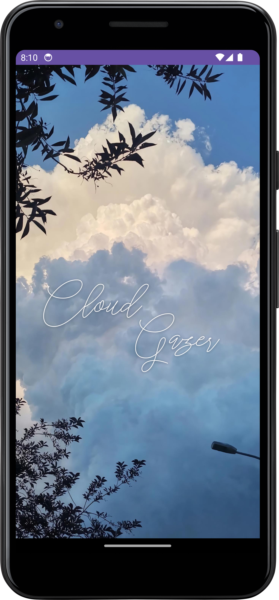
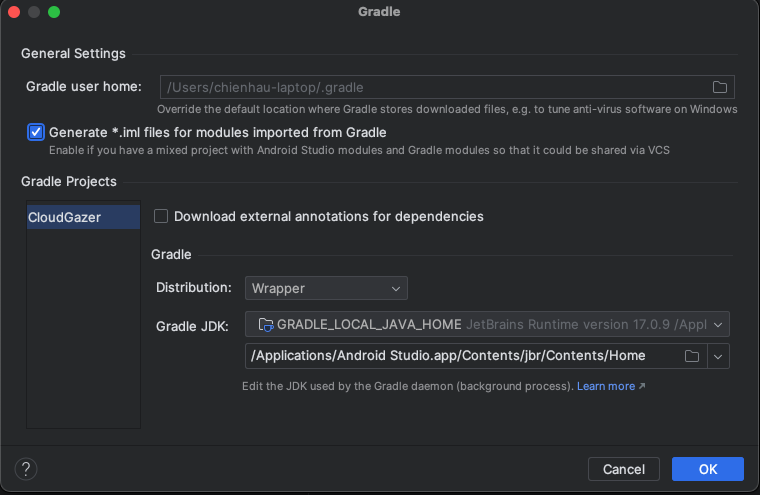

# CloudGazer

CloudGazer is an Android application designed to classify cloud types from images. It uses machine learning techniques to analyze and classify cloud formations.




## Technology
- Android Studio
- Android SDK 
- Gradle
- Pytorch

## Model Information 
[[cloud-classifier]](https://github.com/Yuhanlovescoding/cloud-classifier)

## Demo Video
[[CloudGazer]](https://youtu.be/t9u8u15HrXE)


## Getting Started

These instructions will get you a copy of the project up and running on your local machine for development and testing purposes.

### Prerequisites

What things you need to install the software:

- Android Studio
- Android SDK (API Level 31 or higher recommended)


### Installing

A step-by-step series of examples that tell you how to get a development environment running:

1. **Clone the repository:**

   ```bash
   git clone https://github.com/Yuhanlovescoding/CS5004_-Yuhan_Lin-.git
   ```
2. **Navigate to the CloudGazer directory:**
	
	```bash
	cd CS5004_-Yuhan_Lin-/CloudGazer
	```
3. **Open Android Studio and import the project:**

	Navigate to 'File > Open' and select CloudGazer directory in the cloned repository.
	
4. **Ensure Gradle is configured:**

	When the project is opened in Android Studio, it should 	automatically attempt to load the Gradle files. A 	notification may appear asking you to import Gradle 	settings.
	
	
	
	
	
5. **Create the local.properties file (if not present):**
	
* 	Create a new file named local.properties in the project 	root directory.
* 	Add the SDK location depending on your OS:
	
	For macOS
	
	```bash
	sdk.dir=/Users/[YourUsername]/Library/Android/sdk
	```
	
	For Windows:
	
	```bash
	sdk.dir=C:\\Users\\[YourUsername]\\AppData\\Local\\Android\\Sdk
	```
	

6. **Sync the project with Gradle files:**

	Click on Sync Now in the bar that appears in Android Studio.

7. **Run the app:**
	
	Use Run > Run 'app' to launch the application on an emulator or connected Android device.
	

### Features
* **Image Capture:** Utilize the camera or photo gallery to capture images of clouds.

* **Cloud Classification:** Analyze and classify cloud types through a pre-trained neural network.

* **Results Display:** View detailed descriptions and classifications of clouds directly within the app.


### Architecture
CloudGazer follows the MVVM (Model-View-ViewModel) architecture to ensure a clean separation of concerns and enhance the testability of the code.

* **Model:** Manages the business logic and handles data (cloud types, descriptions, images).
* **View:** UI components (Activities, Fragments) that display cloud data.
* **ViewModel:** Acts as a bridge between the Model and the View, handling UI-related data.

### Core Components
* **SplashActivity:** Initial screen showing a brief introduction.


* **MainActivity:** Entry point of the app, handling navigation and user interactions.


* **CaptureImageActivity:** Manages image capturing and processing.


* **ResultsPagerAdapter:** Displays classification results in a swipeable format.


### User Interface
The UI of CloudGazer is designed to be simple and user-friendly, providing:

* A capture screen to upload or capture cloud images.
* Results screen displaying identified cloud types and descriptions.
* Navigation drawer for switching between different sections of the app.


### Testing
CloudGazer includes comprehensive unit and Android tests to ensure reliability and functionality:

### Android Tests

Android tests are written with Espresso and run with AndroidJUnitRunner:

- **CaptureImageAndroidActivityTest**: Ensures the machine learning model and asset files are properly loaded and accessible. It also tests that the functionality for retrieving the file path of an asset works as expected.

### Unit Tests

Unit tests are performed using Robolectric to simulate the Android environment within the JVM:

- **CaptureImageActivityTest**:
  - Tests the `resizeAndCropImage` method to ensure it correctly resizes and crops an image to the specified dimensions.
  - Tests the `softmax` function to ensure it correctly computes probabilities from given scores, factoring in typical floating-point precision errors.
- **ResultsPagerAdapterTest**:
  - Checks the `getItemCount` method to confirm it returns the correct number of items based on the data provided at initialization.
  - Verifies correct behavior when the adapter is initialized with different data scenarios (empty, single item, multiple items).